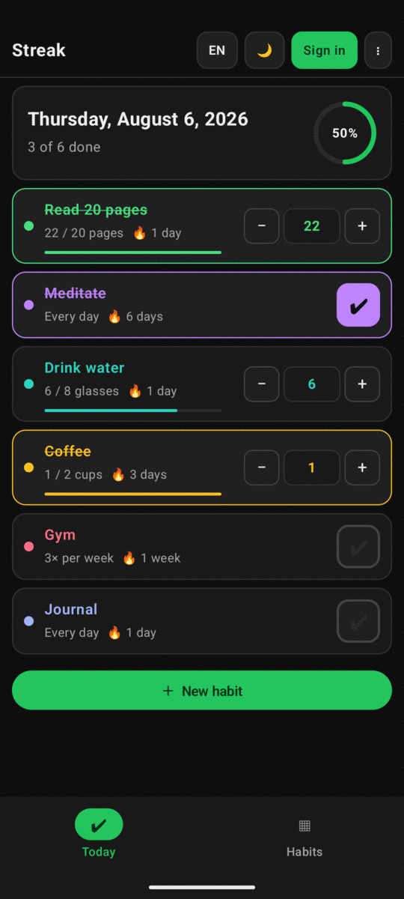
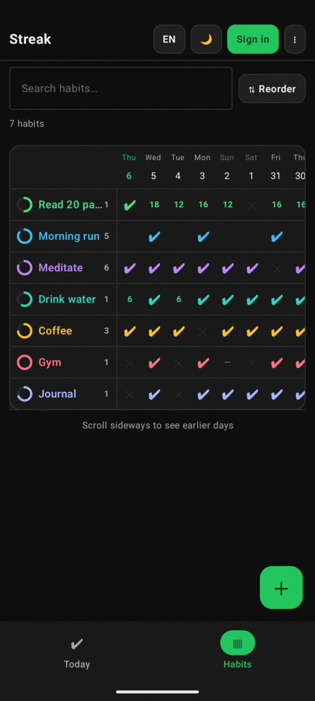
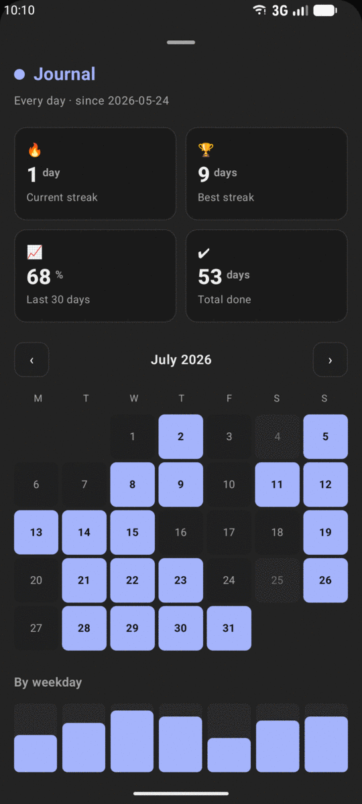
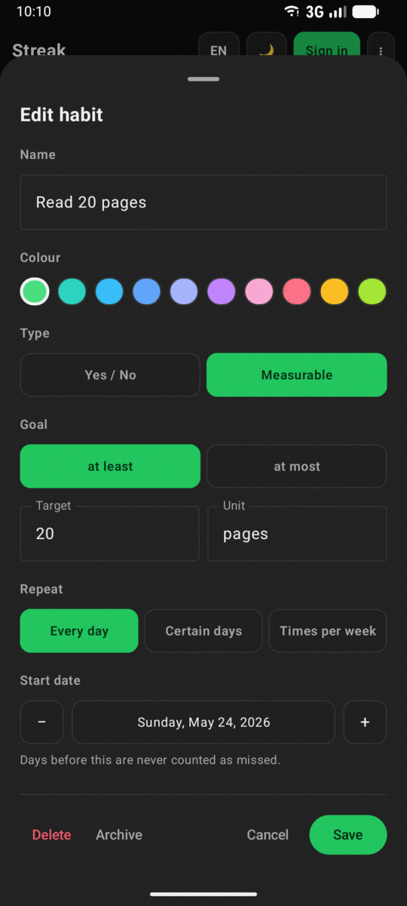
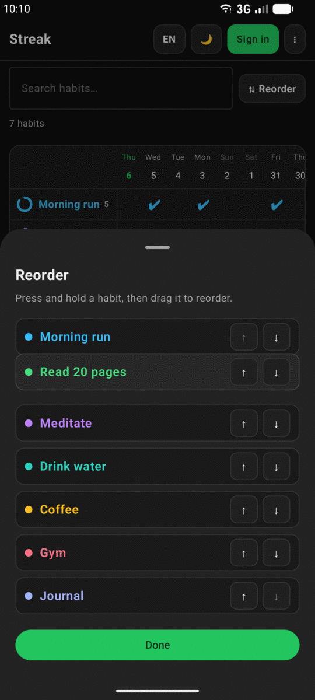
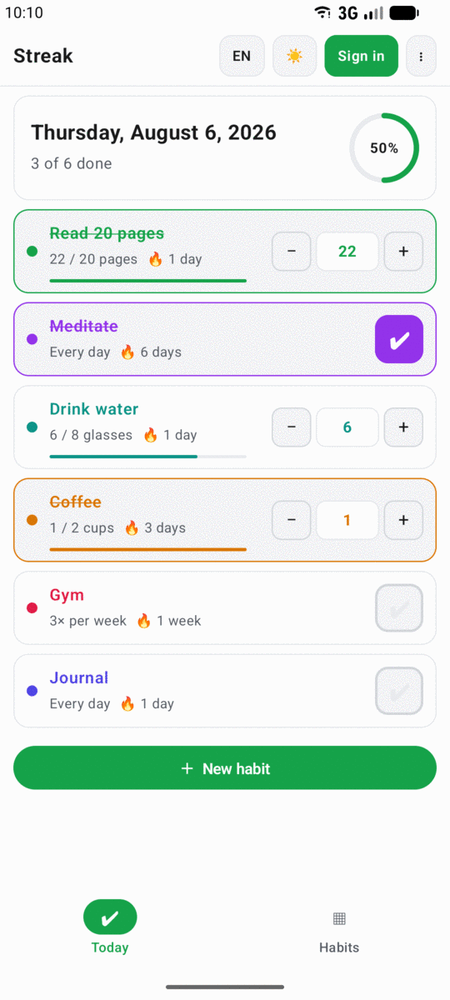
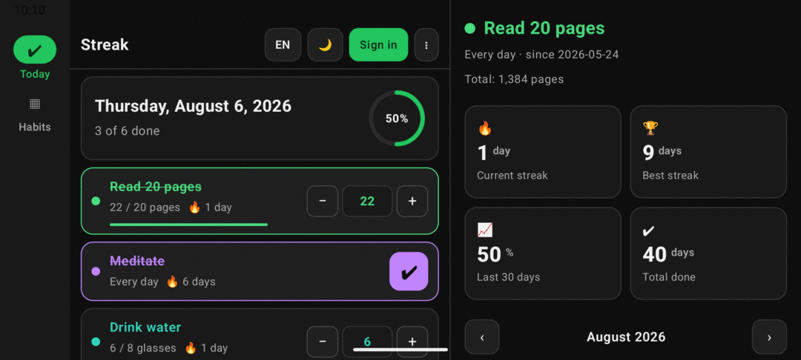

# Streak — Android

The Android counterpart to the web app at **<https://hanifedma.com/streak/>**.

Same habits, same account, same Firestore documents — tick something here and it
appears in the browser about a second later, and the other way round.

Built with Kotlin and Jetpack Compose. No Room, no DI framework, no networking
library: the whole thing is Compose, Firebase and about 3,500 lines of Kotlin.

---

## What it looks like

| Today | Habits grid | Stats |
|:---:|:---:|:---:|
|  |  |  |
| What's due, and how far in | Every habit against every day | Streaks, completion, heatmap |

| Habit editor | Drag to reorder | Light theme |
|:---:|:---:|:---:|
|  |  |  |
| Yes/no or measurable, any schedule | Press and hold a habit, then drag | Same screen, light |

Windows 840dp and wider — a landscape phone, a foldable, a tablet — get the
navigation rail *and* a permanent stats pane, from the same code:



---

## What's in it

Everything the web app does:

- **Today** — a checklist of what's due, with a progress ring
- **Habits grid** — habits down the side, days across the top, newest first
- **Stats** — current/best streak, 30-day completion, month heatmap, by-weekday
- **Habit types** — yes/no, or measurable with a target and unit
  ("Read 10 pages"), with *at least* / *at most* goals
- **Build a habit, or break one** — an *Avoid it* habit ("no sweets") starts
  each day already at **yes**: you tap only on the day you slip, and that day
  is what breaks the streak
- **Schedules** — every day, certain weekdays, or N times per week
- **Skip days** — transparent to streaks, so illness doesn't cost you a streak
- **Reorder** — press and hold a habit anywhere on the row and drag it, or use
  the arrows (which is also the path TalkBack can take)
- **Google sign-in** with real-time sync, or no account at all
- **Offline** — everything works with no signal and syncs when you're back
- **Backup** — export JSON or CSV, import JSON (same format as the web app)
- **Korean and English**, dark and light, Korean and dark by default

Plus one thing the web can't do:

- **Home screen widget** — tick today's habits without opening the app

### Adaptive layout

The window's width decides the layout, not "phone vs tablet" — so it is also
right for a landscape phone, a foldable, and split-screen:

| Width | Layout |
|---|---|
| < 600dp | Bottom navigation bar, single pane |
| 600–840dp | Navigation rail, single pane |
| ≥ 840dp | Navigation rail **and** a permanent stats pane beside the list |

---

## Building it

You need Android Studio (or just the SDK) and **JDK 17+**. The project targets
SDK 37 and runs on Android 7.0 (API 24) and up.

```bash
./gradlew assembleDebug          # build
./gradlew installDebug           # build + install on a connected device
./gradlew testDebugUnitTest      # run the logic tests
./gradlew lintDebug              # static analysis
./gradlew assembleRelease        # the real thing — signed and minified
```

> If Gradle picks the wrong JDK, point it at Android Studio's bundled one:
> `JAVA_HOME=~/android-studio/jbr ./gradlew assembleDebug`

**It builds and runs with no setup at all.** Without `google-services.json` the
app simply runs in device-only mode — no sign-in, no sync, everything else
works. That is deliberate: `app/build.gradle.kts` applies the Google Services
plugin *only* when the file exists, so a fresh clone is never broken.

---

## Release builds

`assembleRelease` produces a signed, R8-minified APK — **3.1 MB against the
debug build's 21 MB**, and without the debug build's `debuggable` flag.

Signing credentials come from a gitignored `keystore.properties` next to the
root build file:

```properties
storeFile=streak-release.jks
storePassword=…
keyAlias=streak
keyPassword=…
```

Without that file (or without the `.jks` it names) the project still builds;
release just comes out unsigned, which is the honest outcome rather than a
confusing failure. Generate a key with:

```bash
keytool -genkeypair -v -keystore streak-release.jks -alias streak \
  -keyalg RSA -keysize 4096 -validity 10000
```

> **Back the `.jks` up somewhere private.** Unlike the Firebase keys it really
> is a secret, and it is unrecoverable: Android only accepts an update signed
> by the same key, so losing it means every installed copy has to be
> uninstalled and reinstalled from scratch.

Add the release key's SHA-1 to Firebase alongside the debug one, or sign-in
works in debug and fails in release:

```bash
keytool -list -v -alias streak -keystore streak-release.jks | grep SHA1
```

### What minification needed

R8 and resource shrinking each broke something that only showed up at runtime,
in release, with no crash to point at. Both fixes are small, and both are
documented where they live rather than here:

| Symptom | Cause | Fix |
|---|---|---|
| Google sign-in fails with a generic error; sync itself works | `default_web_client_id` is read via `getIdentifier`, so the resource shrinker cannot see it in use and drops it. Firebase's own resources survive — those libraries ship keep rules. | `res/raw/keep.xml` |
| Widget renders correctly; tapping a habit does nothing | Glance constructs `ActionCallback`s reflectively, so R8 keeps the class but strips its no-arg constructor. | `keepRules/rules.keep` |

Both are verified by building the APK and dumping its resource table, not by
assuming — the failure modes are quiet enough that assuming is how they ship.

---

## Turning on Google sign-in + sync

Use the **same Firebase project as the web app** so both clients read the same
habits. If you followed the web README, it is `streak-4fc92`.

### 1. Register the Android app in Firebase

1. Firebase console → your project → gear icon → **Project settings**
2. **Your apps** → **Add app** → Android
3. **Package name:** `com.hanifedma.streak` — it must match exactly
4. **Debug signing certificate SHA-1** — required, or Google sign-in fails:

   ```bash
   keytool -list -v -alias androiddebugkey \
     -keystore ~/.android/debug.keystore \
     -storepass android -keypass android | grep SHA1
   ```

   Paste the SHA-1, and add the release keystore's too — see
   [Release builds](#release-builds). A fingerprint is per signing key *and*
   per machine, so a checkout on a second computer needs its own added.
5. Download **`google-services.json`** and drop it in **`app/`**
6. Rebuild. The sign-in screen appears on next launch.

### 2. That's it

No extra Firestore rules are needed — the Android app writes the same
`/users/{uid}/habits/{habitId}` documents the web rules already cover.

> **Why the SHA-1 matters:** Google sign-in on Android identifies your app by
> its signing certificate, not by a secret. Skip it and sign-in fails with a
> vague error even though everything else looks right.

---

## The home screen widget

Long-press the home screen → **Widgets** → **Streak**, or open the app and use
**Settings → Add widget to home screen** (Android 8+).

Tap a row to tick or untick it. Tap the header to open the app.

### How fresh it is — honestly

This is the part worth being precise about, because "real time" means different
things depending on whether the app's process is alive:

| Situation | Freshness |
|---|---|
| App open | **Real time.** A Firestore listener is live, so a tick made in the browser reaches the widget in about a second — including edits, renames and deletions. |
| You tick from the widget | **Instant.** The write goes through Firestore's offline queue and the widget redraws immediately. |
| App closed | **Periodic.** Every ~15 minutes, on unlock, and whenever the widget is tapped or resized. |

That last row cannot be made instant on the free tier, and it is a platform
limit rather than a shortcut: **Android will not keep a network socket open for
a closed app.** Getting an instant push to a closed app needs a server that
pushes to it — a Cloud Function on Firestore write, sending FCM — and Cloud
Functions require Firebase's paid **Blaze** plan.

If you ever want that, the shape is:

1. Cloud Function on `users/{uid}/habits/{id}` write → send a data-only FCM
   message to that user's devices
2. A `FirebaseMessagingService` in the app calls `WidgetSync.refreshNow(context)`

Nothing else changes; the widget already redraws from whatever the data says.
Blaze has a free monthly allowance that this would sit far inside, but it does
require a card on file, so it is deliberately not the default.

---

## How the code is laid out

```
core/       Habits.kt      Pure domain logic — dates, schedules, streaks, stats
            Habit.kt       The model, plus defensive normalisation
data/       HabitStore.kt  One interface, two backends
            CloudStore.kt  Firestore, real-time, offline-queued
            LocalStore.kt  A JSON file; no account needed
            Backup.kt      Export/import, the web app's exact format
            Prefs.kt       Theme, language, week start
auth/       AuthManager.kt Google sign-in via Credential Manager
i18n/       Strings.kt     Korean + English, localised date names
ui/         StreakApp.kt   The adaptive shell
            screens/       Today, grid, stats, editor, sheets, login
            theme/         The web app's palette, verbatim
widget/     HabitWidget.kt Glance widget, its state, and its refresh
```

### Notes on some decisions

**`core/Habits.kt` is a line-for-line port of the web app's `habits.js`,** and
`HabitsTest.kt` is a port of its test suite — 87 tests covering the same rules.
Both clients agreeing on what a streak *is* matters more than either being
clever, and the tests are what keep them agreeing.

**Day keys are always local calendar days** (`"2026-08-05"`), never derived from
UTC. Someone in Seoul ticking a habit at 08:00 would otherwise have it land on
the previous day. Date arithmetic uses calendar fields, so a 23-hour DST day
still counts as one day — the tests run in four timezones to prove it.

**A habit begins at its start date *or its oldest entry*, whichever is earlier.**
Without that, a habit created today with back-filled history has every gap in
that history ignored, and five scattered ticks report as a five-day streak.

**Firestore writes are never awaited.** The task they return only completes when
the *server* acknowledges, so awaiting it hangs forever offline — the tick would
look like it did nothing even though it is already saved and queued.

**Entry values are numbers where 0 is meaningful.** For "smoke at most 0
cigarettes", a recorded 0 is a success and a blank day is not, so the UI shows
"–" for no entry and never a misleading "0".

**A habit's `polarity` decides what an empty day means.** `DO` is the ordinary
kind — nothing recorded, nothing done. `AVOID` ("no sweets") inverts it: an
empty day is **kept**, and a recorded `0` is the day you slipped. Two things
fall out of that and are worth knowing:

- The "empty means kept" rule stops at today, which is why `statusOf` and the
  functions built on it take a `todayK`. Without it, tomorrow and the rest of
  the month would render as a wall of successes nobody has earned yet.
- What a tap writes lives in `Habits.toggleValue`, not in any screen. The Today
  list, the grid and the **home-screen widget** all call it, so a tap means the
  same thing in all three and they cannot drift apart.

---

## Testing

```bash
./gradlew testDebugUnitTest
```

87 tests over the domain logic. To run them under a different timezone — worth
doing after touching anything date-related:

```bash
TZ=America/New_York ./gradlew testDebugUnitTest --rerun-tasks
```

They pass under `Asia/Seoul`, `America/New_York`, `Europe/Berlin` and
`Pacific/Auckland`.

---

## Privacy

Habits are stored in your own Firebase project, readable only by the Google
account that created them. There is no analytics and no third-party SDK beyond
Firebase itself. In device-only mode nothing leaves the phone.
